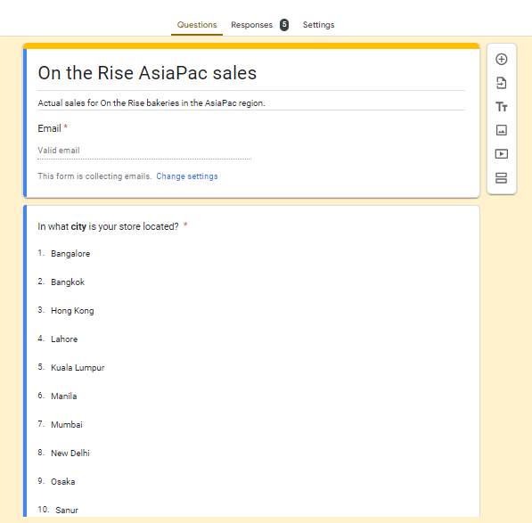
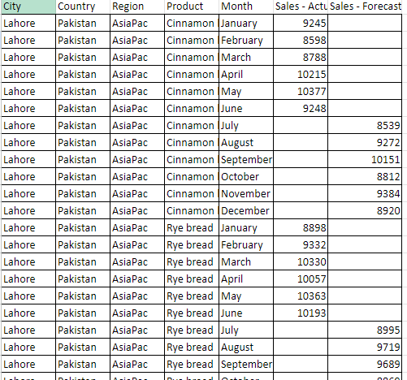
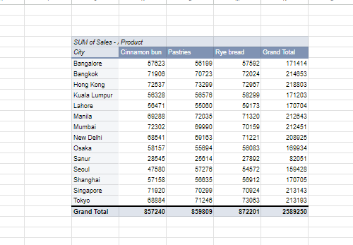
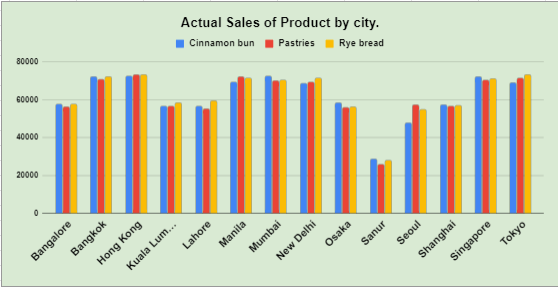
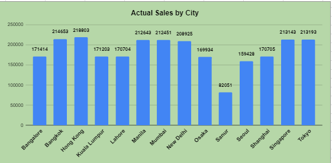
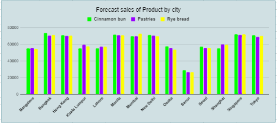
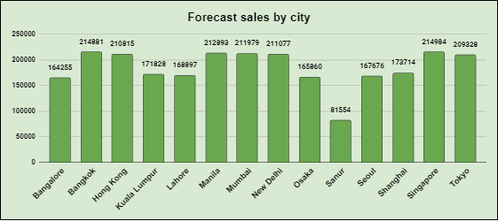

# On The Rise Bakery stores Analysis

---
## Introduction

This project was solely to collect sales data using Google form and analyze the data using Google sheet from an imaginary store **On the Rise Bakery stores**. The project is to uncover insights to answer some of the critical questions concerning which products are selling the best and which locations are doing well, and which of the locations may need some additional support in the next fiscal year in the AsiaPac region.

As we all know, Google sheets is one of the most popular cloud-based spreadsheet applications developed by Google as a part of Google Workspace. It is very similar to MS Excel as it enables us to create and edit our data on spreadsheets and enables us to share our spreadsheets with our co-workers or peers online.
Apart from creating, editing, and sharing spreadsheets, it also provides tons of features for data analysis, automation using formulas and charting. Charting is one of the common usages of Google Spreadsheets. Charting in Google sheets means visually representing the data in a more interactive and user-friendly way using line-charts, bar-charts, pie-charts and more. These charts help us better understand the trends and patterns within our data. Google Sheets provides us built-in tools for charting which allows us to create, customize, embed charts in our spreadsheets easily and present our data in a clear and visually appealing manner. 

**_Disclaimer_** :  _All datasets and reports did not represent any company, institution, or country, but just a dummy dataset to demonstrate the capabilities of google form and google sheet._

## Problem Statement:

1.	Which city has the highest sales?
2.	Which product has the highest patronage?
3.	Which city has the lowest sales?
4.	What city has the greatest sales forecast? 
5.	What city has the lowest sales forecast?

   ## Skills/concepts demonstrated:
   
- Creating a Google sheet to collect sales data securely and quickly from On the Rise stores.
- Creating a Google Form that automatically populates data into Google spreadsheet.
- Data cleaning
- Data presentation using pivot table.
- Data visualizations using charts

##  Modelling:

The modelling comprises of 3 pages.
1.	The Google form for entering the data.
2.	The Google sheet for collecting the data and visualizing the data.
3.	The Pivot table.

## Google form for entering the data.

- Google Forms offer a simple and intuitive interface for creating surveys or forms without the need for advanced technical skills.
- Google Forms and Google Sheets can be adapted for various purposes, from simple surveys to complex data collection and analysis projects, making them versatile tools for different needs.
- The integration of Google Forms and Google Sheets provides a user-friendly, collaborative, and efficient solution for entering, collecting, and analyzing data in various contexts.

## Google sheet for collecting the data and visualizing the data

- Google Sheets provide built-in functions and formulas for basic data analysis.
- Google Sheets use a familiar spreadsheet format, making data entry and organization accessible to users with varying levels of expertise.
- Both Google Forms and Google Sheets are cloud-based, enabling users to access, enter, and analyze data from anywhere with an internet connection.
- Real-time collaboration features in Google Forms and Sheets allow multiple users to work on the same document simultaneously, enhancing teamwork and efficiency.

## The Pivot table.

- Pivot tables in Google Sheets offer a versatile and powerful way to analyze and summarize large.
- Pivot tables allow you to summarize and aggregate large datasets quickly, providing a condensed view of essential information.
- Users can easily drag and drop fields to arrange data by rows and columns, and then apply functions like sum, average, count, etc., to analyze numerical values.
- Pivot tables enable users to compare data across multiple dimensions, making it easier to identify trends, patterns, or disparities.
- You can group and filter data, create calculated fields, and use various display options to compare data points, helping to uncover insights and trends in the dataset.
- Pivot tables provide a dynamic way to explore data interactively, allowing users to adjust the layout and focus on specific aspects of the dataset.
- Users can easily rearrange, expand, or collapse fields within the pivot table, providing a dynamic and interactive experience for exploring different facets of the data.
- These uses demonstrate the flexibility and utility of pivot tables in Google Sheets for summarizing, analyzing, and exploring data in a way that is both efficient and user-friendly.

## Visualization.
The visualization comprises of 4 pages.
1.	Actual Sales of Product by city.
2.	The actual sales by city.
3.	Forecast sales of Product by city.
4.	Forecast sales by city.

You can interact with the reports [here](https://docs.google.com/spreadsheets/d/1PjKESbE7RmGNQUk4H3MuCyb1kXd1eZMuGrsJr0kmV3w/edit?usp=sharing)

# Analysis

## Actual sales of product by city: 

Rye bread achieved the highest sales, totaling 872,201 across the three products, outperforming other items in the lineup.
## Actual sales by city:

Hong Kong has the highest sales with 218,803 across the three products compare to other cities, while Sanur has the lowest sales among the 14 cities with a total of 82,051 sales.

## Forecast sales of Product by city:

Cinnamon bun achieved the highest sales, totaling 861,818 across the three products, outperforming the other two products.

## Forecast sales by city: 

Singapore has the highest sales with 218,803 across the three products compare to other cities, while Sanur has the lowest sales among the 14 cities with a total of 81,554 sales.

# Conclusion and Recommendations

### Conclusion:

1.	Product Performance: Rye bread has consistently performed well, achieving the highest actual sales across the three products, totaling 872,201. However, the forecast sales indicates that Cinnamon bun is expected to surpass the other products.
2.	Regional Disparities: Hong Kong stands out with the highest actual and forecast sales among the cities. Conversely, Sanur consistently records lower sales, indicating a potential area for improvement. 🤓
3.	Surprises and Concerns: There has been lower sales volumes in Shanghai, Seoul, and Kuala Lumpur. These locations need additional support.
	
### Recommendations:

1.	Optimize Rye Bread: Continue to emphasize and optimize the sales strategy for Rye bread, considering its consistent high performance. 😄
2.	Focus on Cinnamon Bun: Given the forecast sales for Cinnamon bun, consider allocating additional resources and marketing efforts to leverage its potential.
3.	Regional Support: Provide additional support to stores in Shanghai, Seoul, and Kuala Lumpur to address unexpected lower sales. This could include targeted marketing campaigns, promotions, or assessing local factors affecting sales.
4.	Evaluate Sanur Strategy: Reevaluate the sales strategy for Sanur, considering its consistently lower sales. Explore potential adjustments to the product mix, pricing strategy, or marketing approach tailored to the local market.
5.	Team Communication: Continue proactive communication with the store teams in Shanghai, Seoul, and Kuala Lumpur. Understand local challenges, gather insights, and collaborate on strategies to boost sales.
   

   

